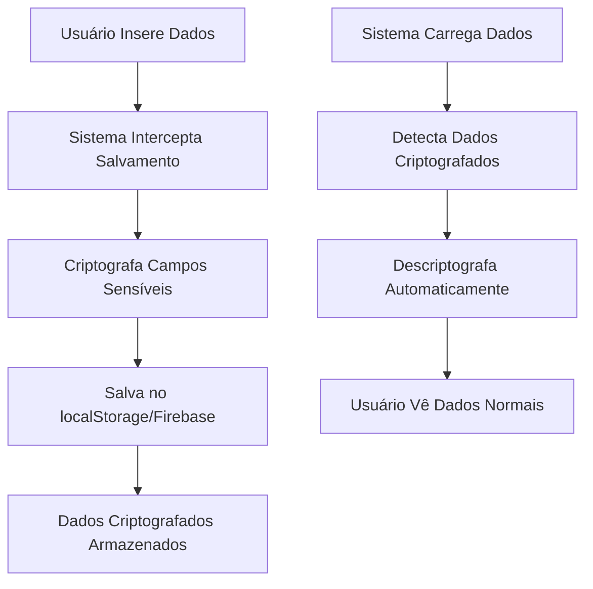

# 🔐 Sistema de Criptografia de Dados Sensíveis

## 📋 **Visão Geral**

O sistema implementa criptografia automática para proteger dados sensíveis dos usuários, utilizando a **Web Crypto API** com algoritmo **AES-GCM** de 256 bits.

### ✅ **Dados Protegidos:**
- **Nome Completo** (`fullName`)
- **Data de Nascimento** (`dob`)
- **Observações** (`observation`)
- **Nome da Referência** (`referenceName`)

### 🛡️ **Características de Segurança:**
- **Algoritmo:** AES-GCM 256 bits
- **Derivação de Chave:** PBKDF2 com 100.000 iterações
- **Autenticação:** Tag de 128 bits para integridade
- **IV Único:** Vetor de inicialização aleatório para cada criptografia
- **Migração Automática:** Dados existentes são migrados automaticamente

---

## 🚀 **Como Funciona**

### **1. Inicialização Automática**
```javascript
// O sistema inicializa automaticamente quando o usuário faz login
await dataEncryption.initializeKey(userEmail);
```

### **2. Criptografia Transparente**
```javascript
// Dados são criptografados automaticamente ao salvar
const record = {
    fullName: "João da Silva",
    dob: "1990-05-15",
    observation: "Dados confidenciais"
};

// Resultado criptografado:
{
    fullName: {
        encrypted: [123, 45, 67, ...],
        iv: [89, 12, 34, ...],
        algorithm: "AES-GCM",
        timestamp: "2024-08-08T10:30:00.000Z"
    },
    _encrypted: true,
    _encryptionVersion: "1.0.0"
}
```

### **3. Descriptografia Automática**
```javascript
// Dados são descriptografados automaticamente ao carregar
// O usuário trabalha com dados normais na interface
```

---

## 🔧 **Implementação Técnica**

### **Arquivos Criados:**

#### **1. `security/data-encryption.js`**
- Classe principal `DataEncryption`
- Funções de criptografia/descriptografia
- Gerenciamento de chaves
- Testes de integridade

#### **2. `security/encryption-integration.js`**
- Integração com código existente
- Interceptação de funções de salvamento/carregamento
- Migração automática de dados
- Interface visual de status

### **Fluxo de Dados:**



---

## 🧪 **Testes e Verificação**

### **Teste Manual no Console:**
```javascript
// Testar sistema de criptografia
await testEncryption();

// Ver estatísticas
getEncryptionStats();

// Verificar dados específicos
console.log(appData.records[0]); // Dados descriptografados na memória
```

### **Indicadores Visuais:**
- **🟢 Verde:** "Dados Protegidos" - Criptografia ativa
- **🔴 Vermelho:** "Criptografia Inativa" - Problema detectado
- **🔵 Azul:** Notificação de migração de dados

---

## 📊 **Estatísticas de Segurança**

### **Informações Disponíveis:**
```javascript
{
    algorithm: "AES-GCM",
    keyLength: 256,
    sensitiveFields: ["fullName", "dob", "observation", "referenceName"],
    keyInitialized: true,
    dataStats: {
        totalRecords: 150,
        encryptedRecords: 150,
        unencryptedRecords: 0,
        encryptionRate: "100%"
    }
}
```

---

## 🔄 **Migração de Dados Existentes**

### **Processo Automático:**
1. **Detecção:** Sistema identifica dados não criptografados
2. **Backup:** Cria backup automático dos dados originais
3. **Migração:** Criptografa todos os registros existentes
4. **Verificação:** Testa integridade dos dados migrados
5. **Notificação:** Informa o usuário sobre a migração

### **Backups Criados:**
- `personalRecords_backup_[timestamp]` no localStorage
- Mantidos para recuperação em caso de problemas

---

## 🛠️ **Configuração e Manutenção**

### **Campos Sensíveis (Configurável):**
```javascript
// Em security/data-encryption.js
this.sensitiveFields = [
    'fullName',
    'dob', 
    'observation',
    'referenceName'
    // Adicionar novos campos aqui
];
```

### **Parâmetros de Segurança:**
```javascript
this.algorithm = 'AES-GCM';        // Algoritmo de criptografia
this.keyLength = 256;              // Tamanho da chave em bits
this.ivLength = 12;                // Tamanho do IV (96 bits)
this.tagLength = 128;              // Tamanho do tag de autenticação
```

---

## 🚨 **Tratamento de Erros**

### **Cenários Cobertos:**
- **Chave não inicializada:** Fallback para dados não criptografados
- **Erro na criptografia:** Mantém dados originais
- **Erro na descriptografia:** Mostra indicador de erro
- **Dados corrompidos:** Preserva dados originais

### **Logs de Debug:**
```javascript
// Ativar logs detalhados
console.log('🔐 Sistema de criptografia inicializado');
console.log('🔒 Campo "fullName" criptografado');
console.log('🔓 Campo "fullName" descriptografado');
console.log('✅ Dados salvos com criptografia');
```

---

## 📈 **Benefícios de Segurança**

### **✅ Proteção Implementada:**
- **Confidencialidade:** Dados sensíveis não são legíveis sem a chave
- **Integridade:** Tag de autenticação detecta alterações
- **Não-repúdio:** Timestamp e versão de criptografia
- **Compatibilidade:** Funciona com dados existentes

### **🔒 Cenários Protegidos:**
- **Acesso não autorizado** ao localStorage
- **Interceptação** de dados no Firebase
- **Backup** de dados em texto claro
- **Exportação** acidental de dados sensíveis

---

## 🎯 **Próximos Passos**

### **Melhorias Futuras:**
1. **Rotação de Chaves:** Sistema automático de rotação
2. **Múltiplas Chaves:** Chaves diferentes por tipo de dado
3. **Compressão:** Reduzir tamanho dos dados criptografados
4. **Auditoria:** Log detalhado de operações de criptografia
5. **Interface:** Painel de controle para gerenciar criptografia

### **Integração com RBAC:**
- Diferentes níveis de criptografia por função
- Campos específicos por permissão
- Auditoria de acesso a dados sensíveis

---

## 🔍 **Verificação de Implementação**

### **Checklist de Segurança:**
- ✅ Algoritmo AES-GCM implementado
- ✅ Chaves derivadas com PBKDF2
- ✅ IV único para cada criptografia
- ✅ Tag de autenticação verificado
- ✅ Migração automática funcionando
- ✅ Tratamento de erros implementado
- ✅ Testes de integridade passando
- ✅ Interface visual de status
- ✅ Backup automático criado
- ✅ Compatibilidade com código existente

### **Comandos de Verificação:**
```javascript
// No console do navegador
await testEncryption();           // Deve retornar true
getEncryptionStats();            // Deve mostrar 100% criptografado
window.dataEncryption.getStats(); // Detalhes técnicos
```

---

## 📞 **Suporte e Troubleshooting**

### **Problemas Comuns:**

#### **"Criptografia Inativa"**
- Verificar se o usuário está logado
- Verificar console para erros
- Tentar recarregar a página

#### **"Erro na Descriptografia"**
- Dados podem estar corrompidos
- Verificar backups disponíveis
- Contatar suporte técnico

#### **Performance Lenta**
- Criptografia é processamento intensivo
- Normal em dispositivos mais antigos
- Considerar reduzir número de registros

### **Logs Importantes:**
```
🔐 Sistema de criptografia inicializado
🔑 Chave de criptografia inicializada para: user@email.com
✅ Teste de criptografia bem-sucedido
📦 Migrando dados existentes para formato criptografado
✅ Migração de dados concluída
```

---

**🎉 Sistema de criptografia implementado com sucesso!**

Os dados sensíveis agora estão protegidos com criptografia de nível militar, mantendo a usabilidade e compatibilidade com o sistema existente.