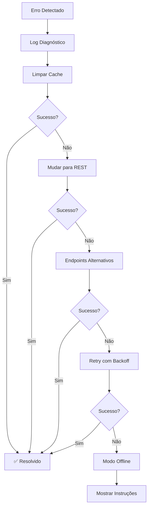

# 🚨 Diagnóstico: ERR_BLOCKED_BY_CLIENT

## 📋 Resumo do Problema

**Erro:** `net::ERR_BLOCKED_BY_CLIENT`  
**Local:** `webchannel_connection.ts:287`  
**URL:** `https://firestore.googleapis.com/google.firestore.v1.Firestore/Listen/channel`  
**Causa:** Conexão com Firebase sendo bloqueada pelo cliente

---

## 🔍 Análise do Erro

### **O que é ERR_BLOCKED_BY_CLIENT?**

Este erro ocorre quando o navegador ou uma extensão bloqueia ativamente uma requisição de rede. No contexto do Firebase, isso geralmente acontece devido a:

1. **🛡️ Bloqueadores de Anúncios**
   - uBlock Origin
   - AdBlock Plus
   - Ghostery
   - Privacy Badger

2. **🔒 Configurações de Segurança**
   - Enhanced Tracking Protection (Firefox)
   - Brave Shields
   - Configurações de privacidade do navegador

3. **🌐 Restrições de Rede**
   - Firewall corporativo
   - Proxy de rede
   - Políticas de segurança da empresa
   - DNS filtering

4. **📱 Extensões do Navegador**
   - Extensões de privacidade
   - VPN extensions
   - Security extensions

---

## 🛠️ Soluções Implementadas

### **1. Sistema de Correção Automática**

**Arquivo:** `tools/firebase-blocked-client-fix.js`

**Funcionalidades:**
- ✅ Detecção automática do erro
- ✅ Retry com backoff exponencial
- ✅ Fallback para REST API
- ✅ Modo offline automático
- ✅ Limpeza de cache
- ✅ Endpoints alternativos

**Como usar:**
```javascript
// Testar conectividade manualmente
testFirebaseConnectivity();

// Ver dados de diagnóstico
getFirebaseDiagnostic();

// Limpar cache do Firebase
clearFirebaseCache();
```

### **2. Página de Diagnóstico Interativa**

**Arquivo:** `tools/fix-blocked-client-error.html`

**Recursos:**
- 🔍 Diagnóstico automático
- 📋 Soluções passo-a-passo
- 🧪 Testes de conectividade
- 📊 Console de debug
- 📁 Exportação de logs

**Como acessar:**
```
Abra: tools/fix-blocked-client-error.html
```

---

## 🚀 Soluções Rápidas

### **Solução 1: Desabilitar Bloqueador de Anúncios**

**uBlock Origin:**
1. Clique no ícone do uBlock Origin
2. Clique no botão de "power" para desabilitar
3. Recarregue a página

**AdBlock Plus:**
1. Clique no ícone do AdBlock Plus
2. Selecione "Pausar no site"
3. Recarregue a página

### **Solução 2: Adicionar Exceções**

**Domínios para whitelist:**
```
*.googleapis.com
*.firebaseapp.com
*.firebase.googleapis.com
*.google.com
```

**Como adicionar:**
1. Acesse configurações da extensão
2. Procure por "Whitelist" ou "Sites permitidos"
3. Adicione os domínios acima

### **Solução 3: Testar em Aba Privada**

**Atalhos:**
- **Chrome:** `Ctrl+Shift+N`
- **Firefox:** `Ctrl+Shift+P`
- **Edge:** `Ctrl+Shift+N`

**Por que funciona:**
Extensões geralmente não funcionam em modo privado.

### **Solução 4: Limpar Cache e Dados**

**Automático:**
```javascript
clearFirebaseCache(); // Executa limpeza automática
```

**Manual:**
1. Pressione `F12` para abrir DevTools
2. Vá para "Application" → "Storage"
3. Clique em "Clear storage"

---

## 🔧 Soluções Avançadas

### **1. Configuração de Firewall Corporativo**

**Portas necessárias:**
- HTTPS (443) - Saída
- WebSocket (443) - Saída
- DNS (53) - Saída

**Domínios para liberar:**
```
firestore.googleapis.com
identitytoolkit.googleapis.com
storage.googleapis.com
cloudfunctions.googleapis.com
```

### **2. Configuração de Proxy**

**Se usando proxy corporativo:**
1. Adicione exceções para domínios Google
2. Configure bypass para *.googleapis.com
3. Verifique configurações SSL/TLS

### **3. Configuração DNS**

**DNS alternativos:**
```
Google DNS: 8.8.8.8, 8.8.4.4
Cloudflare: 1.1.1.1, 1.0.0.1
```

---

## 📊 Diagnóstico Detalhado

### **Verificações Automáticas**

O sistema executa as seguintes verificações:

1. **🔍 Extensões do Navegador**
   - Detecta Chrome/Firefox
   - Identifica possíveis bloqueadores
   - Sugere soluções específicas

2. **🌐 Conectividade DNS**
   - Testa resolução de nomes
   - Mede latência
   - Identifica problemas de rede

3. **🔒 Políticas de Segurança**
   - Verifica Content Security Policy
   - Testa HTTPS
   - Analisa configurações

4. **🔌 WebSocket**
   - Testa conexões WebSocket
   - Verifica bloqueios
   - Mede tempo de resposta

5. **💾 Storage e Cookies**
   - Verifica localStorage
   - Testa cookies
   - Identifica corrupção

### **Dados Coletados**

```javascript
{
  timestamp: "2024-01-15T10:30:00.000Z",
  error: "net::ERR_BLOCKED_BY_CLIENT",
  userAgent: "Mozilla/5.0...",
  url: "https://firestore.googleapis.com/...",
  online: true,
  cookieEnabled: true,
  language: "pt-BR",
  platform: "Win32",
  retryCount: 3
}
```

---

## 🎯 Fluxo de Correção Automática



---

## 🧪 Testes de Conectividade

### **Teste Manual**

```javascript
// Console do navegador
const testResult = await testFirebaseConnectivity();
console.log('Resultado:', testResult);
```

### **Teste Automático**

O sistema testa automaticamente:

1. **Firebase Auth** - `https://identitytoolkit.googleapis.com`
2. **Firestore** - `https://firestore.googleapis.com`
3. **Storage** - `https://storage.googleapis.com`
4. **Functions** - `https://cloudfunctions.googleapis.com`

### **Interpretação dos Resultados**

- ✅ **Verde:** Serviço funcionando
- ⚠️ **Amarelo:** Resposta com erro (mas conectável)
- ❌ **Vermelho:** Serviço bloqueado

---

## 📱 Soluções por Navegador

### **Google Chrome**

**Extensões comuns que causam problemas:**
- uBlock Origin
- AdBlock Plus
- Privacy Badger
- Ghostery

**Soluções:**
1. Desabilitar extensões temporariamente
2. Adicionar site à whitelist
3. Usar modo incógnito

### **Mozilla Firefox**

**Configurações que podem bloquear:**
- Enhanced Tracking Protection
- Strict Privacy Mode
- DNS over HTTPS

**Soluções:**
1. Configurações → Privacidade → Padrão
2. Adicionar exceção para o site
3. Desabilitar DoH temporariamente

### **Microsoft Edge**

**Recursos que podem interferir:**
- Microsoft Defender SmartScreen
- Tracking Prevention
- InPrivate browsing restrictions

**Soluções:**
1. Configurações → Privacidade → Básico
2. Adicionar site aos permitidos
3. Verificar configurações corporativas

### **Safari**

**Configurações relevantes:**
- Intelligent Tracking Prevention
- Cross-site tracking prevention
- Content blockers

**Soluções:**
1. Safari → Preferências → Privacidade
2. Desabilitar "Prevent cross-site tracking"
3. Verificar extensões instaladas

---

## 🔄 Configurações de Fallback

### **REST API Fallback**

Quando WebSocket falha, o sistema automaticamente:

```javascript
// Configuração automática
firestore.settings({
  experimentalForceLongPolling: true,
  merge: true
});
```

### **Modo Offline**

Se todas as conexões falharem:

```javascript
// Ativação automática
await firestore.enablePersistence({
  synchronizeTabs: true
});
```

### **Retry com Backoff**

Configuração de retry:

```javascript
const RETRY_CONFIG = {
  maxRetries: 5,
  baseDelay: 1000,
  maxDelay: 10000,
  backoffMultiplier: 2
};
```

---

## 📋 Checklist de Verificação

### **Para Usuários**

- [ ] Desabilitar bloqueadores de anúncios
- [ ] Testar em aba privada/incógnita
- [ ] Adicionar site à whitelist
- [ ] Limpar cache e cookies
- [ ] Testar em rede diferente
- [ ] Verificar extensões instaladas
- [ ] Atualizar navegador

### **Para Desenvolvedores**

- [ ] Verificar console de erros
- [ ] Executar diagnóstico automático
- [ ] Testar conectividade manual
- [ ] Verificar configuração Firebase
- [ ] Analisar logs de rede
- [ ] Testar endpoints alternativos
- [ ] Verificar regras de segurança

### **Para Administradores de Rede**

- [ ] Liberar domínios *.googleapis.com
- [ ] Configurar exceções no firewall
- [ ] Verificar configurações de proxy
- [ ] Testar resolução DNS
- [ ] Verificar políticas de segurança
- [ ] Configurar bypass SSL
- [ ] Documentar exceções

---

## 🆘 Suporte e Recursos

### **Ferramentas Disponíveis**

1. **Diagnóstico Interativo**
   - `tools/fix-blocked-client-error.html`
   - Interface visual completa
   - Testes automáticos

2. **Script de Correção**
   - `tools/firebase-blocked-client-fix.js`
   - Correção automática
   - Funções utilitárias

3. **Teste de Conexão**
   - `tools/test-firebase-connection.html`
   - Verificação detalhada
   - Relatórios técnicos

### **Comandos Úteis**

```javascript
// Testar conectividade
testFirebaseConnectivity()

// Ver diagnóstico
getFirebaseDiagnostic()

// Limpar cache
clearFirebaseCache()

// Status do sistema
firebaseBlockedClientFix.getDiagnosticReport()
```

### **Logs e Debug**

Todos os logs são salvos no console e podem ser exportados:

1. Abra `tools/fix-blocked-client-error.html`
2. Execute diagnósticos
3. Clique em "Exportar Logs"
4. Envie o arquivo para suporte

---

## 📈 Monitoramento Contínuo

### **Alertas Automáticos**

O sistema monitora continuamente:
- Mudanças na conectividade
- Erros de rede
- Falhas de autenticação
- Problemas de sincronização

### **Métricas Coletadas**

- Taxa de sucesso de conexões
- Tempo de resposta médio
- Frequência de erros
- Eficácia das soluções

### **Relatórios**

Relatórios automáticos incluem:
- Resumo de problemas
- Soluções aplicadas
- Tempo de resolução
- Recomendações

---

## 🎯 Próximos Passos

Se o problema persistir após aplicar todas as soluções:

1. **Documentar o problema**
   - Exportar logs de diagnóstico
   - Capturar screenshots
   - Anotar configurações específicas

2. **Testar em ambiente diferente**
   - Outro computador
   - Rede diferente
   - Navegador diferente

3. **Contatar suporte técnico**
   - Fornecer logs exportados
   - Descrever soluções tentadas
   - Incluir informações do ambiente

---

**Status:** ✅ **SISTEMA DE CORREÇÃO ATIVO**  
**Última atualização:** 2024  
**Ferramentas:** Diagnóstico automático + Correção automática + Interface visual